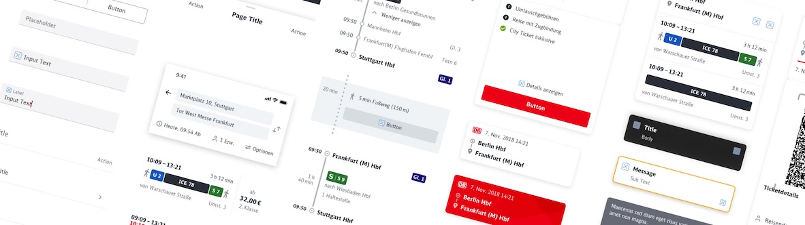

<!-- markdownlint-configure-file { "MD013": false, "MD041":false } -->

<!-- markdownlint-disable MD033 -->

 <!-- width="830" height="276" //-->

<!-- markdownlint-enable MD033 -->

# DB UI Core


[](https://github.com/prettier/prettier)
[](https://github.com/xojs/xo)
[](https://conventionalcommits.org)
[](https://npmjs.com/package/@db-ui/core "DB UI Core – on NPM")

[](http://makeapullrequest.com)
[](CODE-OF-CONDUCT.md)

<!--  -->

> [!IMPORTANT]
> We've released the new stable version of the [DB UX Design System v3](https://github.com/db-ux-design-system/core-web), which is the successor to this generation of DB Design Systems.
> Especially for new projects, we strongly recommend building on [DB UX Design System v3](https://github.com/db-ux-design-system/core-web).<!-- markdownlint-disable MD033 -->
> The new version has some great benefits and optimisations, especially in terms of accessibility testing, further and better framework support and ongoing development.<br>

<!-- markdownlint-enable MD033 -->

> Please note that we won't be providing any new features from now on, only bug fixes until EOL at the end of 2026.

> [!WARNING]
> We've tried a [quick migration to newer SCSS syntax like e.g. `@use` instead of the nowadays deprecated `@import`](https://github.com/db-ui/core/issues/994), but this seems to be more complicated than expected.
> You might face several warnings on the console when using SASS with our packages regarding `@import` usage. If you'd like to prevent those, you might as well want to evaluate migrating to our newer version of the DB UX Design System: <https://github.com/db-ux-design-system/core-web>

DB Personenverkehr and DB Systel have merged their Design Systems for Web [with DB UX Design System v2](https://marketingportal.extranet.deutschebahn.com/marketingportal/Design-Anwendungen/db-ux-design-system/version-2/Components) as their successor. Our goal is to provide a common UX based on the [DB "Moderne Ikone"](https://marketingportal.extranet.deutschebahn.com/marketingportal/Marke-und-Design#) for customer and employee applications. To achieve an end 2 end consistence from conception to implementation, we bring you this new version of DB UI Core (npm: `@db-ui/core`), that is being used within a Design System by S.R (Reisendeninformation) as well.

DB UI Core provides robust HTML UI components, reusable visual styles, and powerful tooling to help developers, designers, and content authors build, maintain, and scale best of class digital experiences.

<!-- markdownlint-disable MD033 MD010 -->
<figure>
	<cite>We’re not designing pages anymore. We’re designing systems of components.</cite>
	<figcaption><a href="https://bradfrost.com/blog/post/bdconf-stephen-hay-presents-responsive-design-workflow/" target="_blank" rel="noopener noreferrer">Stephen Hay</a>. <a href="https://vimeo.com/67476280" title="Brad Frosts at beyond tellerrand conference regarding Atomic Design" target="_blank" rel="noopener noreferrer">Cited in a talk by Brad Frost at beyond tellerrand conference.</a></figcaption>
</figure>

## <abbr title="too long; didn't read">tl;dr</abbr>: "too long" Danny replied

<!-- markdownlint-enable MD033 MD010 -->

- [Getting started](docs/getStarted.adoc)
- [GitHub - DB UI Core](https://github.com/db-ui/core/)
- [Hosted version of DB UI Core living styleguide](https://db.de/db-ui)
- Recommended for JavaScript application development: [DB UI Elements](https://db-ui.github.io/elements/)
- [Migrating guide from version 1 of DB UI Core to version 2](docs/migrationGuide.adoc#user-content-db-ui-core-2-0-0-migration-guide)

## Core principals

### Consistent & Compliant

DB UI Core is based on the [DB UX Design System v2](https://marketingportal.extranet.deutschebahn.com/marketingportal/Design-Anwendungen/db-ux-design-system/version-2/Components), that are the guidelines for any Personenverkehr Customer and Deutsche Bahn Enterprise website and web applications.

### Accessible

DB UI Core leverages semantic HTML, ARIA roles, states and properties to apply our styles wherever possible, thus enforcing correct, accessible markup. And we're quality checking this in partnership with the [Team Digital Accessibility](https://db.de/8pei5n).

### Declarative

DB UI Core uses declarative selectors instead of visual helpers to ensure our HTML class names and structure are human read- and understandable, lean, performant and so much easier to update.

### Decoupled

DB UI Core is decoupled from the JavaScript layer, to implement the patterns in any Web Development technology context; and we're providing universal Web Components and native JS framework components with [DB UI Elements](https://db-ui.github.io/elements/) as well.

### Evergreen

As [DB UX Design System v2](https://marketingportal.extranet.deutschebahn.com/marketingportal/Design-Anwendungen/db-ux-design-system/version-2/Components) evolves, so does DB UI Core, meaning apps only need to keep their DB UI Core package updated to ensure the latest look and feel.

## More information

Additionally we'll provide some more information over time regrading the whole ecosystem:

- [DB UX Design System v2 documentation within the DB Marketingportal (german)](https://marketingportal.extranet.deutschebahn.com/marketingportal/Design-Anwendungen/db-ux-design-system/version-2/Components)
- [Confluence / Base Wiki - "Technische Umsetzung des Enterprise UI Design Systems" (german, only available internally)](https://db.de/pu8moh)
- [Confluence - Web UI Component Library (only available internally)](https://db.de/1tyr73)
- [Changelog](https://github.com/db-ui/core/blob/main/CHANGELOG.md)
- [Architectural Decision Records](https://github.com/db-ui/core/tree/main/docs/adr)
- [DB UI Core 1.x Gitlab repository (only accessible internally)](https://db.de/4cwtyn/)

## Things to keep in mind

### Developed for and driven by the community

This is mainly a platform providing the space and technology for a common basis of curated components; their development is mainly driven by the community and adapted out of the work done in projects and through the huge amount of feedback that we're gaining out of the community. So please support us in any way possible, this is greatly appreciated!

## How to use

Download DB UI Core to get the compiled CSS (and the small parts of JavaScript), source code, or include it with npm package manager (repository on _npmjs.com_ or _yarn_).

### _npmjs.com_ or _yarn_ (recommended)

In case you'd like to use DB UI Core as a dependency in your (frontend) build process and you even also care about handling DB UI Core as a dependency (e.g. for updates etc.), you need to install it as a dependency to your project and then link it within your HTML (CSS file) or within your SCSS.
Please have a look into the [Docs / Get Started](docs/getStarted.adoc) for detailed instructions.

### Download or CDN references

You could as well download all of the files that you would elsewhere retrieve via the node package directly or reference them from a CDN, as provided by the several different services listed e.g. at <https://yarnpkg.com/package/@db-ui/core>

## How to start develop / contribute

```Bash
npm install
npm run build
npm run start
```

Please mind the [conventions for git commits](/docs/conventions.adoc#user-content-git-commits-conventions).

<!-- markdownlint-disable MD026 -->

## Give us your feedback!

<!-- markdownlint-disable MD026 -->

<!-- markdownlint-disable MD033 -->

This is only the first version of our framework and we really want your feedback - either within the <a href="https://db.de/krnm74" target="_blank" rel="noopener noreferrer">DB UI Channel by Web Dev Community in Microsoft Teams (only available DB internally)</a>, or directly at [db-ux-designsystem@deutschebahn.com](mailto:db-ux-designsystem@deutschebahn.com).
We're particularly keen to add as many examples to the behaviours as possible, to further clarify them.

## FAQ

### Our `scss` / `sass` build doesn't work any more after migrating from version 1 of DB UI Core.

In case that you're retrieving any errors like the following, please check for whether you've [provided the location of your `node_modules` folders path to your sass compiler](docs/migrationGuide.adoc#user-content-db-ui-core-2-0-0-migration-guide):

```shell
./src/styles.scss - Error: Module build failed (from ./node_modules/mini-css-extract-plugin/dist/loader.js):
ModuleBuildError: Module build failed (from ./node_modules/sass-loader/dist/cjs.js):
SassError: Can't find stylesheet to import.
╷
│ @use "@csstools/normalize.css/normalize.css";
│ ^^^^^^^^^^^^^^^^^^^^^^^^^^^^^^^^^^^^^^^^^^^^
╵
node_modules\@db-ui\core\sources\css\enterprise\db-ui-core.scss 7:1 @import
node_modules\@db-ui\core\sources\css\enterprise\db-ui-core-include.scss 4:9 @import
src\styles.scss 5:9 root stylesheet
```

## Deutsche Bahn brand

As we'd like to perfectly support our users and customers on their digital journey, the usage of Deutsche Bahn brand and trademarks are bound to clear guidelines and restrictions even when being used with the code that we're providing with this product; Deutsche Bahn fully reserves all rights and ownership regarding the Deutsche Bahn brand, even though that we're providing the code of DB UI products free to use and release it under the Apache 2.0 license.
Please have a look at our [brand portal](https://marketingportal.extranet.deutschebahn.com/) for any further questions and whom to contact on any brand issues. As these assets and visual guidelines are retrieved from our Deutsche Bahn Marketingportal, you'll agree with the ["Allgemeine Nutzungsbedingungen für das DB-Marketingportal" (german)](https://marketingportal.extranet.deutschebahn.com/marketingportal/Nutzungsbedingungen-9702684) in case of using them.

For any usage outside of Deutsche Bahn websites and applications you must remove or replace any Deutsche Bahn brand and design assets as well as protected characteristics and trademarks. We're even also planning to provide a neutral theme that would make it much easier for you to use our product without the trademarks by Deutsche Bahn.

This especially relates to the files in the directories `/source/fonts/`, `source/images` and `source/samples` and `source/favicon.ico` as well.

## Contributions

Contributions are very welcome, please refer to the [contribution guide](CONTRIBUTING.md).

## Third party acknowledgments – many kudos for that !!!

- [open privacy by opr.vc](https://opr.vc)

## Code of conduct

We as members, contributors, and leaders pledge to make participation in our
community a harassment-free experience for everyone – have a look at our [Contributor Covenant Code of Conduct](CODE-OF-CONDUCT.md).

## License

This project is licensed under [Apache-2.0](LICENSE), Copyright 2024 by DB Systel GmbH.
